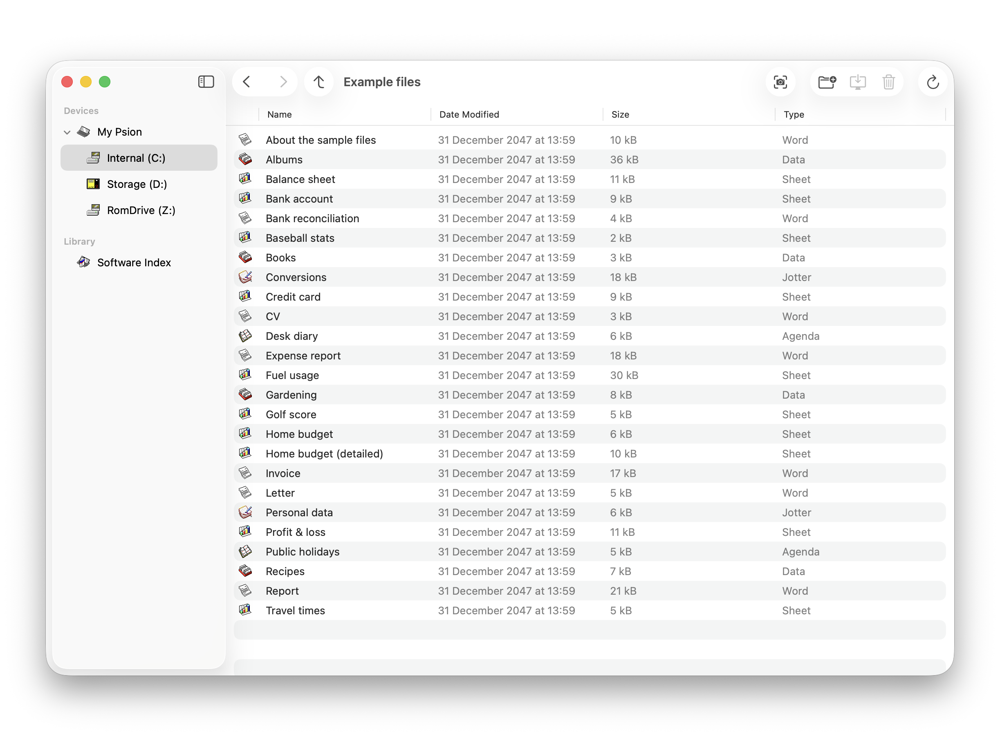

# Reconnect

[](https://github.com/inseven/PsiMac/actions/workflows/build.yaml)

Psion connectivity for macOS.



Reconnect is an attempt to recreate the original Psion PsiMac and MacConnect functionality and UI on modern macOS. It makes use of [plptools](https://github.com/rrthomas/plptools/) for both the PLP (Psion Link Protocol) session layer (NCP) and presentation layers (file server, etc). The plan is to contribute back to plptools where appropriate during development.

The rationale behind creating a new app is that the existing approach taken by plptools, using [FUSE](https://en.wikipedia.org/wiki/Filesystem_in_Userspace) to expose the Psion files to the Mac, isn't practical (or always possible) on modern macOS. Reconnect aims to make it possible to connect a Psion to modern macOS without any development experience or additional software.

## Development

Debugging Reconnect is a little more awkward than normal since plptools uses signals internally which are trapped by Xcode and lldb by default. Disable this automatic behavior by adding the following line to '~/.lldbinit-Xcode':

```
process handle SIGUSR1 -n true -p true -s false
```

## References

- [Psion Link Protocol](https://thoukydides.github.io/riscos-psifs/plp.html)

## License

Reconnect is licensed under the GNU General Public License (GPL) version 2 (see [LICENSE](LICENSE)). It depends on the following separately licensed third-party libraries and components:

- [Diligence](https://github.com/inseven/diligence), MIT License
- [Interact](https://github.com/inseven/interact), MIT License
- [Licensable](https://github.com/inseven/licensable), MIT License
- [Lua](https://www.lua.org), MIT License
- [OpoLua](https://github.com/inseven/opolua), MIT License
- [plptools](https://github.com/rrthomas/plptools), GPL 2.0 License
- [PsionSoftwareIndexSwift](https://github.com/inseven/PsionSoftwareIndexSwift), MIT License
- [Sparkle](https://github.com/sparkle-project/Sparkle), Sparkle License
- [Swift Algorithms](https://github.com/apple/swift-algorithms), Apache 2.0 License
- [Swift Argument Parser](https://github.com/apple/swift-argument-parser), Apache 2.0 License
- [Swift Numerics](https://github.com/apple/swift-numerics), Apache 2.0 License

Reconnect includes graphics (icons and animations) from the original Psion PsiWin and PsiMac software. These remain copyright Psion PLC.
