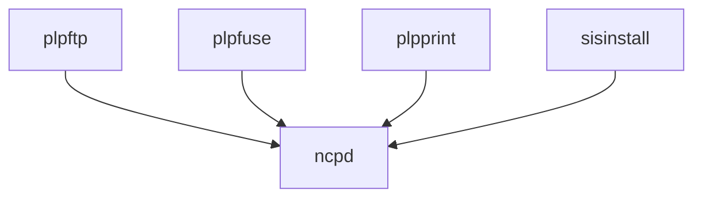

# Introduction

Psions communicate using the [Psion Link Protocol](https://thoukydides.github.io/riscos-psifs/plp.html) (PLP). Reconnect builds on top of [plptools](https://github.com/plptools/plptools), a tried-and-tested open source implementation of PLP for posix-friendly systems.

plptools comprises the following components:

- Service
    - `ncpd`---daemon that manages the connection to a single Psion on a serial port and exposes the different services to the local machine over TCP
- Clients
    - `plpftp`---CLI offering an FTP-like interface for browsing and transferring files
    - `plpfuse`---exposes the connected Psion as local file system using [FUSE](https://en.wikipedia.org/wiki/Filesystem_in_Userspace)
    - `plpprint`---print-server allowing you to print-to-files from your Psion
    - `sisinstall`---CLI for installing SIS installer files on EPOC32 devices

Unfortunately, the evolving security architecture of macOS is increasingly hostile to services like FUSE (you need to [disable System Integrity Protection](https://developer.apple.com/documentation/security/disabling-and-enabling-system-integrity-protection)) to install the required kernel extensions, and having to manually run services like `ncpd` to manage your Psion connection is far from user-friendly, necessitating a different approach on macOS.
