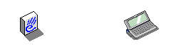
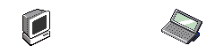

# Introduction

Reconnect includes assets extracted from the original PsiWin and PsiMac software to try to maintain the original 90s feel of using these devices. They remain the copyright of Psion PLC.

Extracting these animations was performed using a combination of 7-Zip, FFmpeg, and ImageMagick.

# Extraction

## Dependencies

I prefer to use [Homebrew](https://brew.sh) to install the dependencies:

```shell
brew install ffmpeg imagemagick p7zip
```

## Animations

PsiWin includes a number of AVI files that are used to indicate on-going progress. These need to be massaged to work with Reconnect:

1. Generate separate animations from the original AVI files using FFmpeg:

   ```shell
   ffmpeg -i SYNC.AVI "frame%04d.png"
   ```

2. Combine those frames into a GIF using ImageMagick for use in Reconnect:

   ```shell
   # 1x
   convert \
       -delay 0 \
       -loop 0 \
       -alpha set \
       -dispose previous \
       -transparent "#00ffff" \
       *.png \
       sync.gif

   # 2x
   convert \
       -scale 200% \
       sync.gif \
       sync@2x.gif
   ```

> [!NOTE]
> The different AVI files use different colors for transparency, so it's necessary to select the correct one during conversion.

This functionality is provided in `scripts/convert-avi.sh`.

For example,

```shell
scripts/convert-avi.sh --transparency "#00ff00" SYNC.AVI .
```

# Files

The complete set of extracted files is displayed here for reference and to ease selecting new assets during development.

## PsiWin

### Animations

#### CNT.AVI


#### INSTALL.AVI



#### SYNC.AVI


